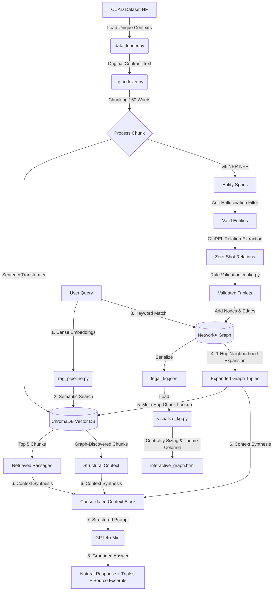

# 🏛️ Legal AI GraphRAG Pipeline

A cutting-edge **Hybrid GraphRAG (Graph-Augmented Retrieval-QA) Engine** tailored for deep contract understanding. It integrates **Dense Semantic Retrieval** (via ChromaDB) with a **Structured Knowledge Graph** extracted using zero-shot information models (**GLiNER** & **GLiREL**). This setup enables accurate natural language question answering on complex legal agreements while dramatically reducing AI hallucinations.

---

## 🏗️ System Architecture & Data Flow

The system forms a dual-retrieval loop that merges structural relational facts with raw semantically relevant text passages:



---

## 📂 Directory Structure

```text
legal-ai-kg/
├── src/
│   └── core/                          # Core pipeline & logic engine (Python package)
│       ├── __init__.py                # Package init — exposes LegalGraphRAG, build_infrastructure, etc.
│       ├── config.py                  # Models, API keys, thresholds, and taxonomy constraints
│       ├── data_loader.py             # CUAD dataset ingestion layer
│       ├── kg_indexer.py              # Text chunker, GLiNER NER, GLiREL relation extractor, DB builder
│       ├── rag_pipeline.py            # Semantic VDB retrieval + 1-hop graph expansion & LLM synthesis
│       └── visualize_kg.py            # PyVis network rendering engine (Vis.js visualization)
├── scripts/                           # Standalone runnable scripts
│   └── index_to_mongodb.py           # MongoDB Atlas bulk indexer
├── tests/                             # Test runners
│   ├── test_rag_pipeline.py           # Standalone MongoDB RAG pipeline test (with argparse)
│   └── test_api_integration.py        # FastAPI server integration test
├── static/                            # Web dashboard assets
│   ├── index.html                     # Dashboard HTML (glassmorphic dark theme)
│   ├── style.css                      # Stylesheet
│   └── script.js                      # Frontend logic (SSE, tabs, chat)
├── data/                              # Dataset directory (CUADv1.json / CUADv1.zip)
├── reports/                           # Metrics output from benchmark runs
├── research/                          # Jupyter notebooks and research artifacts
│   └── import-graph/
├── app.py                             # FastAPI server entrypoint
├── main.py                            # CLI entrypoint (build + query loop)
├── requirements.txt                   # Python dependencies
├── .gitignore                         # Version control exclusions
└── README.md                          # This file
```

---

## 📋 Core Module Reference

| Module | Description | Key Exports |
| :--- | :--- | :--- |
| **`src/core/config.py`** | Models, API keys, file paths, entity labels, relation categories, and logical taxonomy constraints. | `ENTITY_LABELS`, `RELATION_LABELS`, `VALID_RELATIONS` |
| **`src/core/data_loader.py`** | Downloads and loads unique legal contract texts from the CUAD dataset. | `get_cuad_contracts`, `load_cuad_dataset` |
| **`src/core/kg_indexer.py`** | Orchestrates chunking, embedding, NER (GLiNER), relation extraction (GLiREL), and populates ChromaDB + NetworkX graph. | `build_infrastructure`, `chunk_text` |
| **`src/core/visualize_kg.py`** | Generates an interactive, dark-themed HTML graph using PyVis. | `generate_interactive_graph`, `COLOR_MAP` |
| **`src/core/rag_pipeline.py`** | Semantic vector retrieval, keyword-to-node matching, graph expansion, and LLM prompt generation. | `LegalGraphRAG`, `answer_query` |
| **`app.py`** | FastAPI backend: SSE pipeline build stream, chat API, static content serving. | `build_pipeline_stream`, `chat` |
| **`main.py`** | CLI orchestrator: builds infrastructure, renders graph, starts interactive query loop. | `main` |

---

## 🛠️ Step-by-Step Execution Guide

To run this application locally, you can choose between two entrypoints:

### 1. Web Dashboard Interface (Recommended)
Start the FastAPI server:
```powershell
python app.py
```
* **URL**: Open your browser at `http://localhost:8000`.
* **Flow**:
  1. Click the **"Start Analysis Demo"** button on the glassmorphic landing card.
  2. The server will stream live progress (dataset downloads, model loading, relational validations).
  3. Upon completion, the interactive PyVis **Knowledge Graph** loads in the main panel.
  4. Use the tabs to browse the **Original Contract** or engage in **QA Chat** with real-time semantic + graph debugging.

### 2. Command Line Interface (CLI)
For a terminal-based interface:
```powershell
python main.py
```
* **Flow**:
  1. Automatically runs indexing, builds `./chroma_db`, and saves `legal_kg.json`.
  2. Generates the `interactive_graph.html`.
  3. Starts a query prompt loop displaying extracted triples, parsed contexts, and AI answers.

### 3. MongoDB Atlas Bulk Indexer
To index all CUAD contracts into MongoDB Atlas for cloud-based vector search:
```powershell
python scripts/index_to_mongodb.py
```

---

## 💎 Design Highlights & Innovations

1. **Anti-Hallucination Triplet Validation**:
   In `config.py`, the `VALID_RELATIONS` dictionary prevents GLiNER and GLiREL from establishing spurious connections. Relations like `entered_into_by` are restricted to valid nodes (e.g. `Party` / `Organization`), dropping any illogical links.
2. **Context Enrichment (Multi-Hop Graph Expansion)**:
   In `rag_pipeline.py`, the retrieval engine first searches vector space (ChromaDB) for the query, and then cross-checks matching entities against the graph. It retrieves structural nodes and *hops* back into the vector database to pull passages that contain relevant relations, even if those passages didn't rank high in direct semantic search.
3. **Immersive Glassmorphic UI**:
   The dashboard implements stunning web elements—including translucent glass containers, customizable chat avatars, smooth hover scaling, and an interactive accordion panel revealing the detailed GraphRAG vector extraction details behind every response.

---

## 🛠️ Technology Stack & Dependencies

* **MongoDB Atlas Vector Search** - Cloud-hosted vector database for scalable semantic similarity search.
* **Groq (Llama 3.3 70B)** - High-performance LLM serving as the central reasoning engine.
* **BAAI/bge-small-en-v1.5** - Sentence embedding model producing dense 384-dimensional semantic vectors.
* **GLiNER** - Zero-shot named entity recognition (NER) model.
* **GLiREL** - Zero-shot relation extraction model.
* **NetworkX** - Network modeling library managing the Knowledge Graph.
* **PyVis** - Interactive visualization library generating dark-themed HTML dynamic graphs.
* **FastAPI** - Modern Python web framework powering the backend API.
* **ChromaDB** - Lightweight local vector database for offline embedding storage.
* **Sentence Transformers** - PyTorch-based framework for dense vector embeddings.
* **GitHub Actions** - Automated CI/CD pipeline execution.
