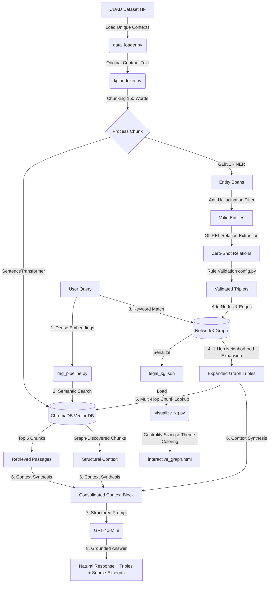

# 🏛️ Legal AI GraphRAG Pipeline

A cutting-edge **Hybrid GraphRAG (Graph-Augmented Retrieval-QA) Engine** tailored for deep contract understanding. It integrates **Dense Semantic Retrieval** (via ChromaDB) with a **Structured Knowledge Graph** extracted using zero-shot information models (**GLiNER** & **GLiREL**). This setup enables accurate natural language question answering on complex legal agreements while dramatically reducing AI hallucinations.

---

## 🏗️ System Architecture & Data Flow

The system forms a dual-retrieval loop that merges structural relational facts with raw semantically relevant text passages:



---

## 📂 Core Directory & File Inventory

The project structure is organized as follows:

| File / Folder | Type | Description | Key Classes / Functions |
| :--- | :--- | :--- | :--- |
| **`config.py`** | Configuration | Declares models, API keys, file paths, entity labels, relation categories, and logical taxonomy constraints. | `ENTITY_LABELS`, `RELATION_LABELS`, `VALID_RELATIONS` |
| **`data_loader.py`** | Data Ingestion | Downloads and loads unique legal contract texts from the **CUAD (Contract Understanding Atticus Dataset)** on Hugging Face. | `get_cuad_contracts` |
| **`kg_indexer.py`** | KG/Vector Build | Orchestrates chunking, text embedding, named entity recognition (GLiNER), relation extraction (GLiREL), and populates ChromaDB and the NetworkX graph. | `build_infrastructure`, `chunk_text` |
| **`visualize_kg.py`** | Visualizer | Generates an interactive, dark-themed HTML graph simulation using **PyVis**, styled based on entity taxonomy and centrality. | `generate_interactive_graph`, `COLOR_MAP` |
| **`rag_pipeline.py`** | RAG Core Engine | Performs semantic vector retrieval, keyword-to-node matching, graph expansion, chunk ID synthesis, and prompt generation. | `LegalGraphRAG`, `answer_query` |
| **`app.py`** | Web Server | FastAPI backend providing an SSE pipeline build progress stream, chat interface, and static content serving. | `build_pipeline_stream`, `chat` |
| **`main.py`** | CLI Entrypoint | Command-line loop for building, rendering, and querying the system interactively. | `main` |
| **`static/index.html`** | Frontend HTML | Structured dark-themed dashboard featuring tabs for the Interactive Graph, Original Document, and Chat QA interface. | Dashboard UI markup |
| **`static/style.css`** | Styling | Glassmorphic dark designs, hover glowing effects, custom chat bubbles, and layout adjustments. | Core stylesheet |
| **`static/script.js`** | Frontend Logic | Connects to SSE stream `/api/build/stream`, coordinates active tabs, manages chat rendering, and handles Markdown answers. | Chat controllers, SSE handlers |
| **`requirements.txt`** | Dependencies | Python project dependency definitions. | GLiNER, GLiREL, ChromaDB, FastAPI, PyVis |

---

## 🛠️ Step-by-Step Execution Guide

To run this application locally, you can choose between two entrypoints:

### 1. Web Dashboard Interface (Highly Recommended)
Start the FastAPI server:
```powershell
python app.py
```
* **URL**: Open your browser at `http://localhost:8000`.
* **Flow**:
  1. Click the **"Start Analysis Demo"** button on the glassmorphic landing card.
  2. The server will stream live progress (Hugging Face dataset downloads, model token indexing, relational validations).
  3. Upon completion, the interactive PyVis **Knowledge Graph** loads in the main panel.
  4. Use the tabs to browse the **Original Contract** or engage in **QA Chat** with real-time semantic + graph debugging.

### 2. Command Line Interface (CLI)
For a terminal-based interface:
```powershell
python main.py
```
* **Flow**:
  1. Automatically runs indexing, builds `./chroma_db`, and saves `legal_kg.json`.
  2. Generates the `interactive_graph.html`.
  3. Commences a query prompt loop displaying extracted triples, parsed contexts, and AI answers directly.

---

## 💎 Design Highlights & Innovations

1. **Anti-Hallucination Triplet Validation**:
   In `config.py`, the `VALID_RELATIONS` dictionary prevents GLiNER and GLiREL from establishing spurious connections. Relations like `entered_into_by` are restricted to valid nodes (e.g. `Party` / `Organization`), dropping any illogical links.
2. **Context Enrichment (Multi-Hop Graph Expansion)**:
   In `rag_pipeline.py`, the retrieval engine first searches vector space (ChromaDB) for the query, and then cross-checks matching entities against the graph. It retrieves structural nodes and *hops* back into the vector database to pull passages that contain relevant relations, even if those passages didn't rank high in direct semantic search.
3. **Immersive Glassmorphic UI**:
   The dashboard implements stunning web elements—including translucent glass containers, customizable chat avatars, smooth hover scaling, and an interactive accordion panel revealing the detailed GraphRAG vector extraction details behind every response.
